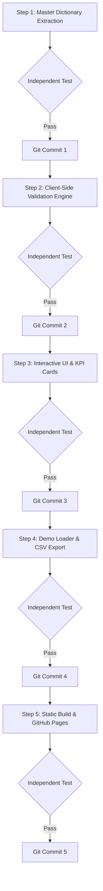

# Implementation Guidelines & Execution Roadmap

This document defines the development roadmap, testing protocols, and version control guidelines for building the **JA-MENTOR Youth Survey Option Auditor & Validator**.

---

## 🎯 Core Principles

1. **Step-by-Step Roadmap Execution:** Work proceeds strictly in sequential, atomic milestones. Each step must be fully implemented, independently tested, and verified before moving to the next.
2. **Independent Test Agent Verification:** For each roadmap milestone, a separate, independent testing agent/process must write and run automated tests (unit tests, regression benchmarks against reference ground truth, or browser automation tests) to validate functionality before sign-off.
3. **Atomic Git Commits:** Each roadmap step must culminate in a dedicated, descriptive Git commit once all independent tests pass green.

---

## 🗺️ Execution Roadmap

---

### Step 1: Master Specification & Dictionary Extraction

* **Goal:** Extract canonical question definitions, variable names, response options, frequency rankings, and special codes (`997`, `998`, `999`) from the master English specification (`data/mentor_fhi-EN.xlsx`) into a lightweight, standalone dictionary format (JSON / embedded JS module).
* **Implementation Deliverables:**
  * Extraction script and pre-compiled canonical data dictionary (`src/master_dictionary.json` or embedded in `index.qmd`).
* **Independent Test Protocol:**
  * Test script compares extracted dictionary against reference ground truth (`reference/output/codebook_variables.csv` and `reference/output/codebook_options.csv`).
  * Verify exact coverage: all canonical variables and option levels must be accurately enumerated with valid codes.
* **Git Commit Convention:**
  `feat: extract canonical master survey dictionary`

---

### Step 2: Client-Side Validation & Mapping Engine

* **Goal:** Build the in-browser validation logic using JavaScript and SheetJS to parse raw survey exports (`Content_Export_*.xlsx`), normalize headers, match observed options to canonical options, and classify each variable into its audit status:
  * 🟢 **Fully Identified**
  * 🟡 **Observed Only / Incomplete**
  * 🔴 **Missing Options**
  * ⚪ **Open-Ended / Continuous**
* **Implementation Deliverables:**
  * Pure client-side parsing and classification module.
* **Independent Test Protocol:**
  * Run automated node/JS unit tests against sample exports (`data/Content_Export_MENTORMasterGER1_Test-GER-1.xlsx`).
  * Assert that status counts and mappings match expected reference classifications.
* **Git Commit Convention:**
  `feat: implement client-side audit validation logic`

---

### Step 3: Interactive Dashboard UI & KPI Cards

* **Goal:** Create the interactive Quarto application (`index.qmd`) featuring:
  * Prominent purpose banner explaining cross-country data harmonization.
  * Drag-and-drop file upload area.
  * Real-time KPI summary cards (Total Variables, 🟢, 🟡, 🔴, ⚪) with click-to-filter capability.
  * Searchable, sortable variable table with expandable rows showing detailed option mappings and translation matches.
* **Implementation Deliverables:**
  * Styled, responsive `index.qmd` with modern CSS tokens and mobile-friendly layout.
* **Independent Test Protocol:**
  * Browser subagent test verifying UI element rendering, table interactivity, responsive layout, and KPI card filter responsiveness.
* **Git Commit Convention:**
  `feat: add interactive dashboard UI and status filters`

---

### Step 4: Demo Data Loader & Discrepancy CSV Export

* **Goal:** Add convenience features for seamless user testing and field team reporting:
  * *"Load Sample Data"* button to instantly test using the bundled example export without manual file upload.
  * *"Export Audit Issues"* button to generate and download a clean CSV report listing all flagged variables (🔴/🟡), missing options, and translation discrepancies.
* **Implementation Deliverables:**
  * Embedded sample dataset handler and client-side CSV blob generator.
* **Independent Test Protocol:**
  * Browser subagent test verifying that clicking *"Load Sample Data"* populates the dashboard immediately, and clicking *"Export Audit Issues"* generates a valid CSV matching expected discrepancies.
* **Git Commit Convention:**
  `feat: add demo data loader and issue report export`

---

### Step 5: Static Build & GitHub Pages Deployment

* **Goal:** Render the standalone Quarto web application into static HTML (`docs/` folder) with zero backend dependencies, ready for one-click hosting on GitHub Pages.
* **Implementation Deliverables:**
  * Compiled `docs/index.html` and bundled assets.
  * Verified GitHub Pages deployment workflow.
* **Independent Test Protocol:**
  * Validate that the static site in `docs/` functions fully offline and locally in browser memory without external server calls or data leaks (GDPR verification).
* **Git Commit Convention:**
  `docs: render web app and configure GitHub Pages deployment`

---

## 🔒 Verification & Quality Rules (Instructions for AI Agents)

1. **Mandatory Test Phase Before Every Commit:**
   * An implementation milestone must **never** be committed directly upon code generation.
   * Every step **must** pass through its dedicated independent test phase.
2. **Automated Test Protocol (Steps 1 & 2):**
   * The agent must write a dedicated, standalone test file in `tests/` (e.g., `tests/test_step1_dictionary.py` or `tests/test_step2_engine.js`) that asserts functionality against `reference/output/codebook_variables.csv` and `codebook_options.csv`.
   * The test suite must be executed in a separate test process (`python tests/...` or `node tests/...`) and exit with code `0` before proceeding to Git commit.
3. **Browser Subagent Protocol (Steps 3, 4, & 5):**
   * The primary agent **must call the `browser_subagent` tool** to spin off an autonomous browser agent.
   * The browser subagent must:
     1. Navigate to the local preview URL (e.g. `http://localhost:...` or rendered `docs/index.html`).
     2. Perform real user interactions (click buttons, toggle KPI filter cards, trigger demo data loading, click export buttons).
     3. Verify DOM elements, table rows, and state transitions.
     4. Capture WebP session recordings in the artifacts directory.
4. **Zero-Error Gate:** If any test fails or the browser subagent reports missing elements/discrepancies, the primary agent must fix the issue, re-run tests, and only commit once 100% verified.
5. **Client-Side Data Privacy:** All file reading and auditing logic must run exclusively inside local browser RAM; no network transmissions of uploaded files are permitted.
6. **Reference Integrity:** Do not alter the canonical definitions in `mentor_fhi-EN.xlsx` or reference ground truth outputs without explicit alignment.
